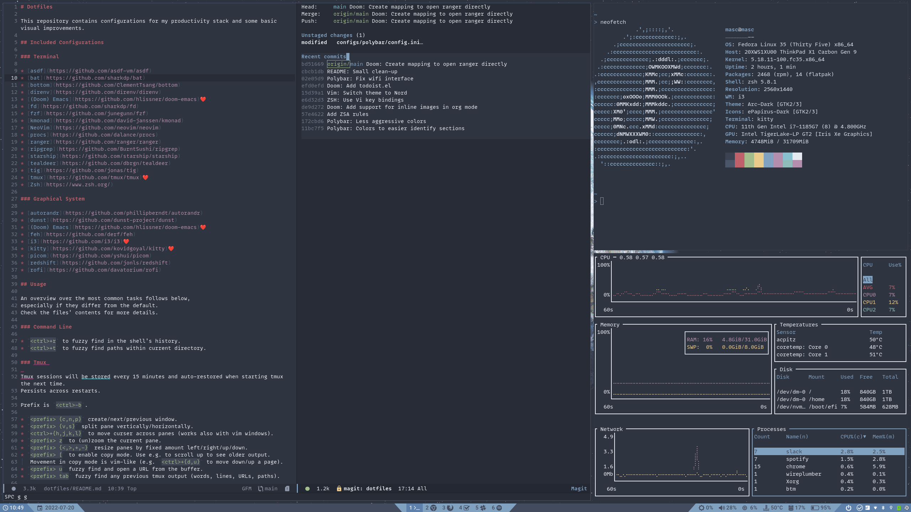

# Dotfiles

This repository contains configurations for my productivity stack and some basic visual improvements.

## Included Configurations

### Terminal

* [asdf](https://github.com/asdf-vm/asdf)
* [bat](https://github.com/sharkdp/bat)
* [bottom](https://github.com/ClementTsang/bottom)
* [direnv](https://github.com/direnv/direnv)
* [fd](https://github.com/sharkdp/fd)
* [fzf](https://github.com/junegunn/fzf)
* [kmonad](https://github.com/david-janssen/kmonad)
* [NeoVim](https://github.com/neovim/neovim)❤️
* [procs](https://github.com/dalance/procs)
* [ranger](https://github.com/ranger/ranger)
* [ripgrep](https://github.com/BurntSushi/ripgrep)
* [starship](https://github.com/starship/starship)
* [tealdeer](https://github.com/dbrgn/tealdeer)
* [tig](https://github.com/jonas/tig)
* [tmux](https://github.com/tmux/tmux)❤️
* [Zsh](https://www.zsh.org/)

### Graphical System

* [autorandr](https://github.com/phillipberndt/autorandr)
* [dunst](https://github.com/dunst-project/dunst)
* [feh](https://github.com/derf/feh)
* [i3](https://github.com/i3/i3)❤️
* [kitty](https://github.com/kovidgoyal/kitty)❤️
* [picom](https://github.com/yshui/picom)
* [redshift](https://github.com/jonls/redshift)
* [rofi](https://github.com/davatorium/rofi)

## Usage

An overview over the most common tasks follows below,
especially if they differ from the default.
Check the files' contents for more details.

### Command Line

* `<ctrl>+r` to fuzzy find in the shell's history.
* `<ctrl>+t` to fuzzy find paths within current directory.

### Tmux

Tmux sessions will be stored every 15 minutes and auto-restored when starting tmux the next time.
Persists across restarts.

Prefix is `<ctrl>-b`.

* `<prefix> {c,n,p}` create/next/previous window.
* `<prefix> {v,s}` split pane vertically/horizontally.
* `<ctrl>+{h,j,k,l}` to move curser across panes (works also with vim windows).
* `<prefix> z` to (un)zoom the current pane.
* `<prefix> {<,>,+,-}` resize panes by fixed amount left/right/up/down.
* `<prefix> [` to enable copy mode. Use e.g. to scroll up to see older output.
   Movement in copy mode is vim-like (e.g. `<ctrl>+{d,u}` to move down/up a page).
* `<prefix> u` fuzzy find and open a URL from the buffer.
* `<prefix> tab` fuzzy find any previous tmux output (words, lines, URLs, paths).
* `<prefix> <alt-1>` split all windows evenly horizontally (`<alt-2>` for vertically).

### NeoVim

Waiting for a short period opens `which-key` and lists all key options.
Alternatively, you could `:WhichKey<CR>`.

Below a list of valuable keymaps, which `which-key` usually does not show:

* In [telescope](https://github.com/nvim-telescope/telescope.nvim), `<c-t>` opens the result list in a [trouble](https://github.com/folke/trouble.nvim) window.

### i3

Installation is based on Fedora i3 spin with i3 replaced with i3-gaps.

See the i3 config for all keybindings. Most relevant:

* `$mod` is by default "super"/"windows".
* `$mod+d` to launch application.
* `$mod+m` to see configuration options.
* `$mod+Shift+e` to exit, lock, etc.
* `$mod+r` to resize.
* `$mod+p` to take a screenshot.
* `$mod+Shift+c` to reload config.

#### Monitor layouts

The system includes [autorandr](https://github.com/phillipberndt/autorandr) to automatically detect and apply screen layouts based on the connected monitors.
If you have a new layout set up using for example arandr, run `autorandr --save <name>` to save the layout with the given name.
Autorandr should automatically apply this layout the next time the monitors are connected identically.
You can manually load a profile using `autorandr --load <name>`.
