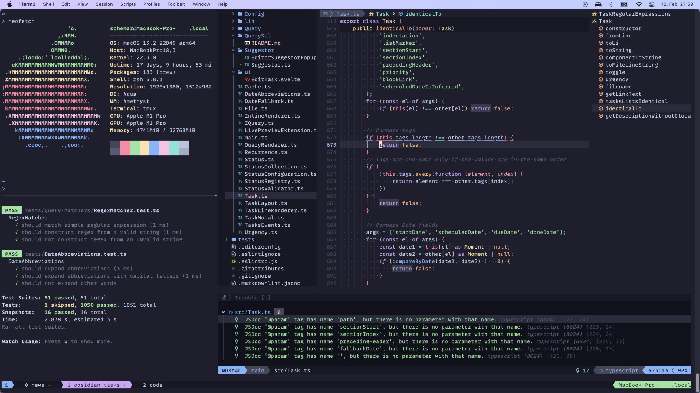

# Dotfiles

This repository contains configurations for my productivity stack and some basic visual improvements.

## Included Configurations

### Terminal

- [bat](https://github.com/sharkdp/bat)
- [bottom](https://github.com/ClementTsang/bottom)
- [efm](https://github.com/mattn/efm-langserver)
- [fzf](https://github.com/junegunn/fzf)
- [gitui](https://github.com/extrawurst/gitui)
- [helix](https://github.com/helix-editor/helix)
- [lsd](https://github.com/lsd-rs/lsd)
- [mise](https://github.com/jdx/mise)
- [NeoVim](https://github.com/neovim/neovim)❤️
- [ranger](https://github.com/ranger/ranger)
- [starship](https://github.com/starship/starship)
- [tmux](https://github.com/tmux/tmux)❤️
- [yazi](https://github.com/sxyazi/yazi)
- [Zsh](https://www.zsh.org/)

### Graphical System

- [wezterm](https://github.com/wez/wezterm)❤️

## Usage

An overview over the most common tasks follows below,
especially if they differ from the default.
Check the files' contents for more details.

### Command Line

- `<ctrl>+r` to fuzzy find in the shell's history.
- `<ctrl>+t` to fuzzy find paths within current directory.

### Tmux

Tmux sessions will be stored every 15 minutes and auto-restored when starting tmux the next time.
Persists across restarts.

Prefix is `<ctrl>-a`.

- `<prefix> {c,n,p}` create/next/previous window.
- `<prefix> {v,s}` split pane vertically/horizontally.
- `<ctrl>+{h,j,k,l}` to move cursor across panes (works also with vim windows).
- `<prefix> z` to (un)zoom the current pane.
- `<prefix> {<,>,+,-}` resize panes by fixed amount left/right/up/down.
- `<prefix> [` to enable copy mode. Use e.g. to scroll up to see older output.
  Movement in copy mode is vim-like (e.g. `<ctrl>+{d,u}` to move down/up a page).
- `<prefix> u` fuzzy find and open a URL from the buffer.
- `<prefix> tab` fuzzy find any previous tmux output (words, lines, URLs, paths).
- `<prefix> <alt-1>` split all windows evenly horizontally (`<alt-2>` for vertically).

### NeoVim

Prerequisites:

- `npm install -g tree-sitter`
- And possibly language tools which weren't automatically installed via mason.
  - For example `npm install -g eslint_d` after setup of `asdf` is complete.

Usage:

- When you first run NeoVim, `lazy.nvim` will install itself.
  After, run: `:Lazy` and `I` to `install` all plugins.
  Restart NeoVim.
- When you re-start NeoVim, `treesitter` should install its packages and `mason`
  should install all kinds of language servers and tools.
  Restart NeoVim.

### Yazi

- `F` to change view to single-column
- `o` to open file "in other tmux pane" with helix's `:open` command
